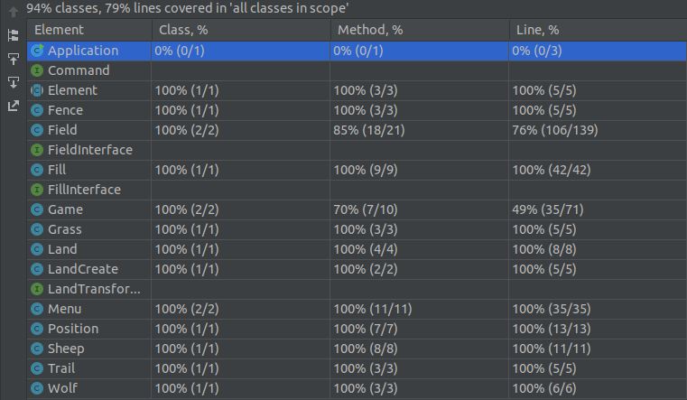

# LDTS_G0205 - The Sheep's Escape

## Game Description

The Sheep's Escape is a text-based game where you control a sheep. You have to fill the land with grass so that the sheep hides from wolves. If you fill 80% of the land you win and if wolves hits you or your trail you die.

Project developed by  Daniela Tomás (up202004946@edu.fc.up.pt), Nuno Penafort (up202008405@edu.fc.up.pt) and Sofia Sousa (up202005932@edu.fc.up.pt) for LDTS 2021-22.

## Implemented Features

- **Buttons** - Functional and interactive buttons.
- **Keyboard Control** - The keyboard inputs are received through the respective events and interpreted according the current game state.
- **Player Control** - The player can move the sheep with the arrow keys.
- **Collision Detections** - Collisions between different objects are verified (Ex: Sheep and Wolves).
- **Pause** - The key 'p' can be used to pause the game.
- **Restart** - The key 'r' can be used to restart the game.
- **Quit** - The key 'q' can be used at any time to quit the game.

## Planned Features

- Not all planned features were implemented, such as having different types of wolves, special items...

## Design
### General Structure
#### Problem in Context:
Since our game is a GUI our first concern was how the structure would look like.

#### The Pattern:
We used the **_Command Pattern_** that encapsulate a request as an object thereby letting you parameterize clients with different requests.

#### Implementation:

#### Consequences:
- Decouples the object that invokes the operation from the one that knows how to perform it.
- Commands can be extended and manipulated like any other object.
- You can create Composite commands.
- It's easy to add new commands.

## Known Code Smells and Refactoring Suggestions

#### **Large Class**
Some classes contain many fields and many methods (especially Field and Fill classes). In some cases it is even necessary but in others we could have improved.

#### **Write Simple Conditions**
Some methods (e.g. insideGrass (Fill class), run (Game class)) contain a lot of loops and conditions. We could split methods in two or improve the complexity. It would even be much easier to test.

## Testing
### Screenshot of coverage report

### Link to mutation testing report
[Mutation Test](../build/reports/pitest/202201291629)

### Self-evaluation
- Daniela Tomás: 33.3%
- Nuno Penafort: 33.3%
- Sofia Sousa: 33.3%

